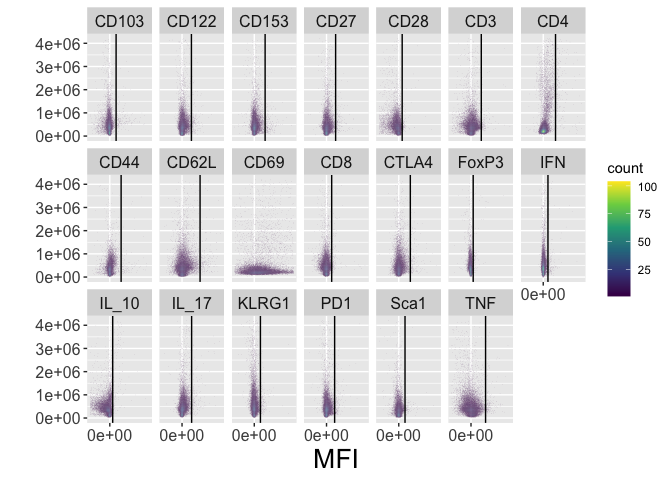
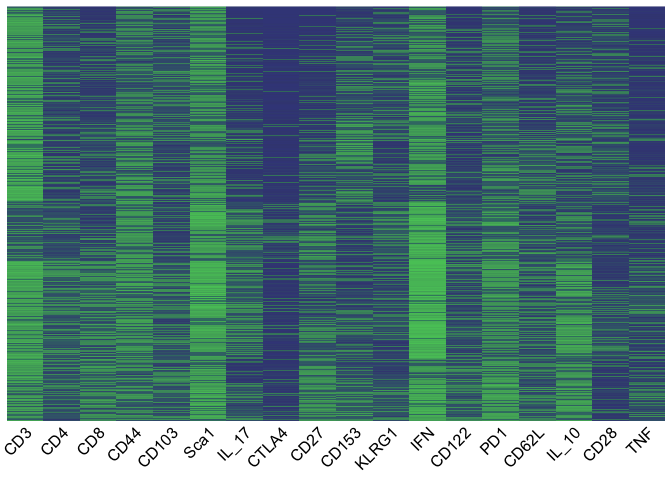
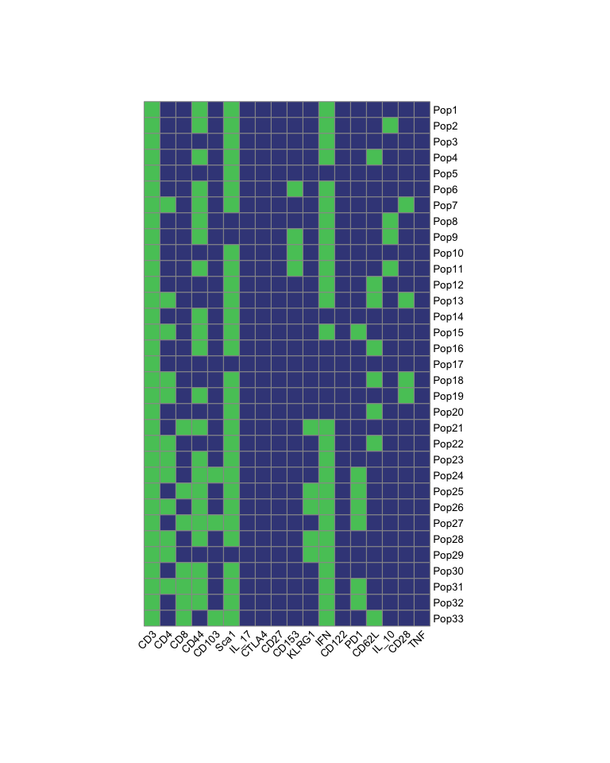
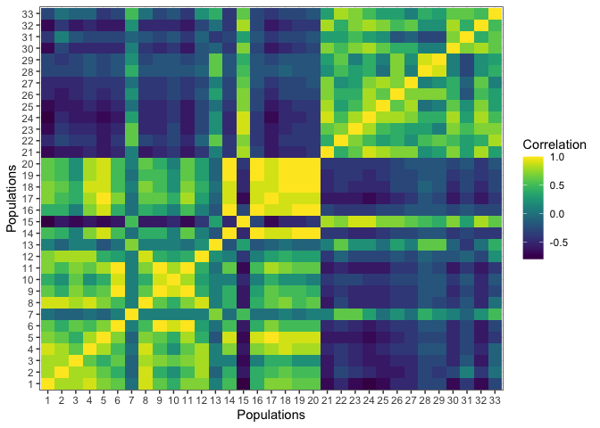
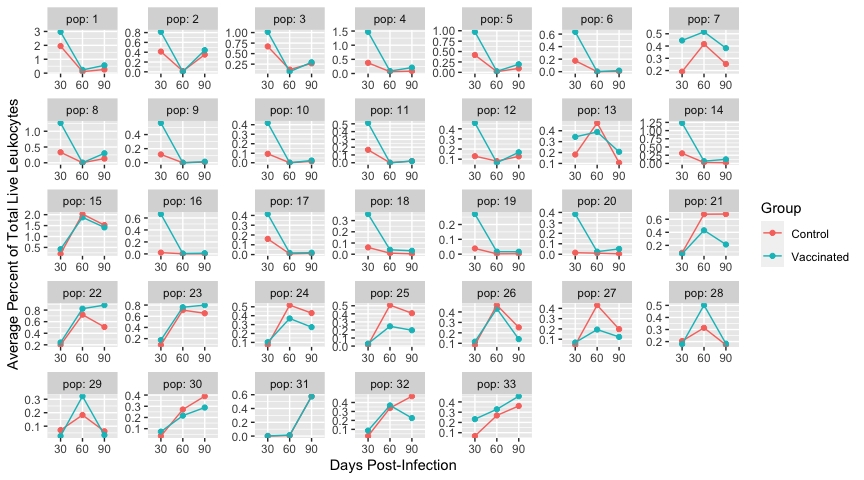
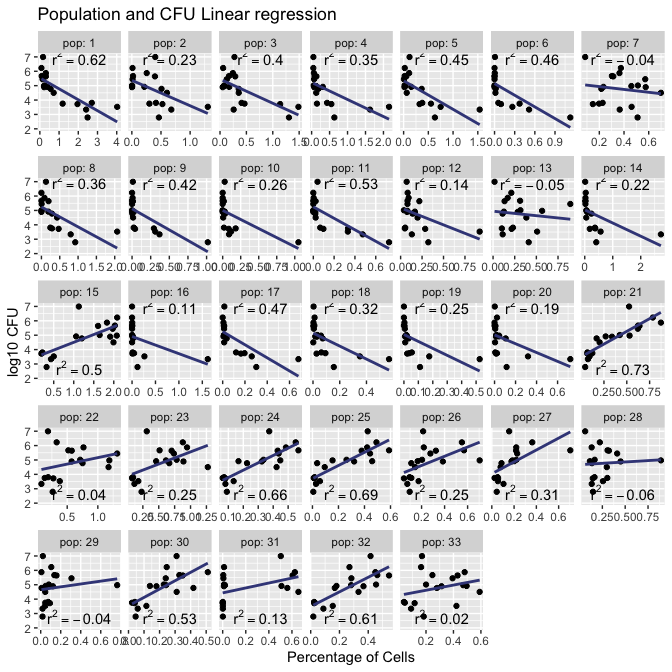

The goal of cytotypr is to identify flow cytometry cell populations
efficiently using either Fluorescent Minus One controls (FMOs) or
distinct population differences.

## Installation

You can install the development version of cytotypr from
[GitHub](https://github.com/) with:

``` r
# install.packages("devtools")
devtools::install_github("aef1004/cytotypr")
```

## Basic Example

This is a basic example which shows you how to obtain basic results and
plots for flow cytometry data using FMOs:

``` r
library(cytotypr)
## basic example code
```

List of additional packages needed to run this example

``` r
library(data.table)
library(dplyr)
library(stringr)
library(tidyr)
library(tibble)
library(ggplot2)
library(readxl)
library(broom)
library(purrr)
```

The data that is being used in this example is from the paper
“Cyto-feature engineering….” The samples are from the lungs of C57BL/6
mice that were either sham-vaccinated or vaccinated with an
*Mycobacterium tuberculosis* vaccine, Bacillus Calmette–Guérin (BCG).
The flow cytometry panel is used to elucidate specific T cell
populations.

For the purpose of this basic example, the flow cytometry samples have
been read in as a flowset and initial gating has already been applied to
limit the data to measurements of live, singlet lymphocyte cells.

## Convert flowSet to “tidy data” format

We first want to convert the data to a “tidy data” format, to allow us
to work with “tidyverse” tools for further analysis and visualization.

Apply this function to the ‘flowSet’ of gated FMO data:

``` r
FMO_gated_data <- tidy_flow_set(flowset_FMO_gated_data)
FMO_gated_data
#> # A tibble: 417,910 x 49
#>    filename  Time `SSC-H` `SSC-A` `FSC-H` `FSC-A` `BV421-H` `Pacific Blue-H`
#>    <chr>    <dbl>   <dbl>   <dbl>   <dbl>   <dbl>     <dbl>            <dbl>
#>  1 CD103.f…   130  105692  1.26e5  354442  6.45e5     -58.8             295.
#>  2 CD103.f…   137  270246  3.16e5 1094791  1.59e6   -6837.              181.
#>  3 CD103.f…   139  326197  3.77e5 1312044  1.80e6   -6375.             2438.
#>  4 CD103.f…   149   74523  8.52e4  295947  5.57e5     285.              542.
#>  5 CD103.f…   159  103797  1.10e5  293302  4.86e5    -419.              250.
#>  6 CD103.f…   215  188622  2.20e5  355468  5.51e5    -589.             1265.
#>  7 CD103.f…   233  275485  3.18e5 1264605  1.57e6   -3984.              770.
#>  8 CD103.f…   242  262851  3.03e5  931615  1.20e6   -5463.             -680.
#>  9 CD103.f…   501  205731  3.60e5  578193  6.76e5    -782.              865.
#> 10 CD103.f…   590 1510416  2.11e6 1396843  1.87e6  -56700.              192.
#> # … with 417,900 more rows, and 41 more variables: `BV480-H` <dbl>,
#> #   `BV510-H` <dbl>, `BV570-H` <dbl>, `BV605-H` <dbl>, `BV650-H` <dbl>,
#> #   `BV711-H` <dbl>, `BV785-H` <dbl>, `BB515-H` <dbl>, `Alexa Fluor
#> #   532-H` <dbl>, `PE-H` <dbl>, `PE-Dazzle594-H` <dbl>, `PE-Cy5-H` <dbl>,
#> #   `PE-Cy5.5-H` <dbl>, `PerCP-eFluor 710-H` <dbl>, `PE-Cy7-H` <dbl>,
#> #   `APC-H` <dbl>, `APC-R700-H` <dbl>, `APC-Fire 750-H` <dbl>, `AF-H` <dbl>,
#> #   `BV421-A` <dbl>, `Pacific Blue-A` <dbl>, `BV480-A` <dbl>, `BV510-A` <dbl>,
#> #   `BV570-A` <dbl>, `BV605-A` <dbl>, `BV650-A` <dbl>, `BV711-A` <dbl>,
#> #   `BV785-A` <dbl>, `BB515-A` <dbl>, `Alexa Fluor 532-A` <dbl>, `PE-A` <dbl>,
#> #   `PE-Dazzle594-A` <dbl>, `PE-Cy5-A` <dbl>, `PE-Cy5.5-A` <dbl>, `PerCP-eFluor
#> #   710-A` <dbl>, `PE-Cy7-A` <dbl>, `APC-A` <dbl>, `APC-R700-A` <dbl>,
#> #   `APC-Fire 750-A` <dbl>, `Zombie Nir-A` <dbl>, `AF-A` <dbl>
```

``` r
# note that here the filename and the column marker names need to match exactly
df_FMO_gated_data <- FMO_gated_data %>%
  dplyr::select(ends_with("-A"), -`FSC-A`, `SSC-A`, filename) %>%
  dplyr::rename(`FoxP3` = "APC-A",
         `CD44` = "APC-Fire 750-A",
         `CD103` =  "APC-R700-A",       
         `CD3` = "Alexa Fluor 532-A",
         `Sca1` = "BB515-A",
         `IL_10` = "BV421-A",
         `CD4` = "BV480-A",
         `CD69` = "BV510-A",
         `CD8` = "BV570-A", 
         `CTLA4` = "BV605-A",
         `CD27` = "BV650-A",
         `CD153` = "BV711-A",
         `KLRG1` = "BV785-A",
         `IL_17` = "PE-A",
         `CD122` = "PE-Cy5-A",
         `IFN` = "PE-Cy7-A", 
         `CD62L` = "PE-Dazzle594-A",
         `TNF` = "Pacific Blue-A", 
         `CD28` = "PE-Cy5.5-A",
         `PD1` = "PerCP-eFluor 710-A")  %>%
   na.omit()%>%
  dplyr::filter(`SSC-A` != max(`SSC-A`)) %>%
  dplyr::mutate(filename = str_replace(filename, ".fcs", "")) %>%
  dplyr::mutate(filename = str_replace(filename, "IFNG", "IFN"))

  
FMO_filtered_data <- filter_FMO(df_FMO_gated_data)

add_quantile <- get_99(FMO_filtered_data)

plot_FMOs(FMO_filtered_data, add_quantile)
#> Warning: Removed 25721 rows containing missing values (geom_vline).
```



# Gated Data

Pull out the gated data

``` r
# tidy the flowset and convert to a dataframe
df_all_gated <-  tidy_flow_set(flowset_gated_data) 

unique(df_all_gated$filename)
#>  [1] "D30_Lung_Group_1_A.fcs" "D30_Lung_Group_1_B.fcs" "D30_Lung_Group_1_C.fcs"
#>  [4] "D30_Lung_Group_2_A.fcs" "D30_Lung_Group_2_B.fcs" "D30_Lung_Group_2_C.fcs"
#>  [7] "D60_Lung_Group_1_A.fcs" "D60_Lung_Group_1_B.fcs" "D60_Lung_Group_1_C.fcs"
#> [10] "D60_Lung_Group_2_A.fcs" "D60_Lung_Group_2_B.fcs" "D60_Lung_Group_2_C.fcs"
#> [13] "D90_Lung_Group_1_A.fcs" "D90_Lung_Group_1_B.fcs" "D90_Lung_Group_1_C.fcs"
#> [16] "D90_Lung_Group_2_A.fcs" "D90_Lung_Group_2_B.fcs" "D90_Lung_Group_2_C.fcs"
```

# Feature engineer the data

Feature cut the data to get all of the possible populations for each
file with the cell count and number of cells. Feature engineering is
based on the 99%.

Remove FoxP3 (APC-A) Remove CD69 (BV510-A)- spreading from Sca1 makes
the marker unusable

Original

``` r
all_fe <- df_all_gated %>%
  mutate(Timepoint = str_extract(filename, "D[0-9]*")) %>%
  mutate(Group = str_extract(filename, "Group[:punct:][0-9][:punct:][A-Z]"),
         Group = str_replace(Group, "Group_", "")) %>%
  unite(filename, c("Timepoint", "Group")) %>%
  dplyr::filter(`SSC-A` != max(`SSC-A`)) %>%
  select(ends_with("-A"), -`FSC-A`, -`Zombie Nir-A`, -`AF-A`, -`SSC-A`, filename) %>%
  dplyr::rename(`FoxP3` = "APC-A",
         `CD44` = "APC-Fire 750-A",
        `CD103` =  "APC-R700-A",       
         `CD3` = "Alexa Fluor 532-A",
         `Sca1` = "BB515-A",
         `IL_10` = "BV421-A",
         `CD4` = "BV480-A",
         `CD69` = "BV510-A",
         `CD8` = "BV570-A", 
         `CTLA4` = "BV605-A",
         `CD27` = "BV650-A",
         `CD153` = "BV711-A",
         `KLRG1` = "BV785-A",
         `IL_17` = "PE-A",
         `CD122` = "PE-Cy5-A",
         `IFN` = "PE-Cy7-A", 
         `CD62L` = "PE-Dazzle594-A",
         `TNF` = "Pacific Blue-A", 
         `CD28` = "PE-Cy5.5-A",
         `PD1` = "PerCP-eFluor 710-A") %>%
  select(-CD69, -FoxP3) %>%
  mutate(CD3 = fe(add_quantile, CD3, "CD3"),
         CD4 = fe(add_quantile, CD4, "CD4"),
         CD8 = fe(add_quantile, CD8, "CD8"),
         CD44 = fe(add_quantile, CD44, "CD44"),
         CD103 = fe(add_quantile, CD103, "CD103"),
         Sca1 = fe(add_quantile, Sca1, "Sca1"),
         IL_17 = fe(add_quantile,IL_17, "IL_17"),
         CTLA4 = fe(add_quantile,CTLA4, "CTLA4"),
         CD27 = fe(add_quantile,CD27, "CD27"),
         CD153 = fe(add_quantile,CD153, "CD153"),
         KLRG1 = fe(add_quantile,KLRG1, "KLRG1"),
         IFN = fe(add_quantile,IFN, "IFN"),
         CD122 = fe(add_quantile,CD122, "CD122"),
         PD1 = fe(add_quantile,PD1, "PD1"),
         CD62L = fe(add_quantile,CD62L, "CD62L"),
         IL_10 = fe(add_quantile,IL_10, "IL_10"),
         CD28 = fe(add_quantile,CD28, "CD28"),
         TNF = fe(add_quantile,TNF, "TNF")) %>%
  count_calc()
```

# Visulatizations

Initial identification of populations plot

We first want to view all of the different cell phenotypes within the
data

``` r
# this is the order of markers that we want for all of our plots
order_of_markers <- c("CD3", "CD4", "CD8",  "CD44", "CD103", "Sca1", "IL_17","CTLA4",
                      "CD27",  "CD153", "KLRG1", "IFN",  "CD122", "PD1", "CD62L",
                      "IL_10", "CD28","TNF")

# to view all of the possible combinations
total_phenotypes <- filter_for_total_pheno(all_fe, marker_order = order_of_markers)

heatmap_all_pheno(total_phenotypes)
```



``` r

# gives the total number of populations
nrow(total_phenotypes) 
#> [1] 10912
```

After identifying all phenotypes, we can filter the data to see the ones
that we’re interested in, for example, CD3+ cells that constitute \>0.5%
of total live leukocytes in a sample.

``` r
# view the specific cell phenotypes we're interested in
sample_populations <- all_fe %>%
  dplyr::filter(CD3 == 1 & percentage > 0.5) %>%
  filter_pops() 

sample_populations_all_groups <- identified_pop_perc(sample_populations, all_fe, 
                                                     marker_vector = order_of_markers)
#> Joining, by = "population"
#> Joining, by = c("filename", "IL_10", "TNF", "CD4", "CD8", "CTLA4", "CD27", "CD153", "KLRG1", "Sca1", "CD3", "IL_17", "CD62L", "CD122", "CD28", "PD1", "IFN", "CD103", "CD44")
```

Plot sample populations

``` r

simple_pop_df <- sample_populations %>%
  column_to_rownames("population") 

simple_pop_df %>%
  dplyr::select(all_of(order_of_markers)) %>%
  mutate_all(~convert_factor_numeric(.)) %>%
    pheatmap::pheatmap(cluster_rows = FALSE, cluster_cols = FALSE,
             labels_row = rownames(simple_pop_df),
             cellwidth = 15, cellheight = 15, angle_col = 45, 
             color = c("#3F4788FF", "#56C667FF"), cutree_rows = 2, legend = FALSE)
```



Correlation plot

``` r

corr <- calc_corr(sample_populations_all_groups)

melted_corr <- format_corr(corr)
  
plot_corr(melted_corr) +
    ggplot2::xlab("Populations") +
    ggplot2::ylab("Populations") +
    ggplot2::labs(fill = "Correlation") 
```



Time Series Plot

``` r

# take the data for filtered populations and rename so that plots are pretty

pops_for_plots_average <- sample_populations_all_groups %>%
  tidyr::separate(filename, into = c("Timepoint", "Group", "Number"),
                  sep = "_") %>%
  dplyr::group_by(population, Timepoint, Group) %>%
  dplyr::summarise(average_percent = mean(percentage)) %>%
  dplyr::mutate(Group = str_replace(Group, "1", "Control"),
         Group = str_replace(Group, "2", "Vaccinated")) %>%
  dplyr::mutate(Timepoint = str_extract(Timepoint, "[0-9].+"))%>%
  dplyr::mutate(pop = as.numeric(str_extract(population, "[:digit:]+"))) 
#> `summarise()` has grouped output by 'population', 'Timepoint'. You can override using the `.groups` argument.


ggplot(pops_for_plots_average, aes(x = Timepoint, y = average_percent, 
                                   group = Group, color = Group)) +
  scale_fill_identity() +
  geom_point() +
  geom_line() +
  facet_wrap("pop", scales = "free", ncol = 7, labeller = label_both) +
  xlab("Days Post-Infection") +
  ylab("Average Percent of Total Live Leukocytes") +
  theme_gray() 
```



Data Visualization

  - CFU Correlation

<!-- end list -->

``` r

CFUs <- readxl::read_xlsx("./inst/extdata/CFU_data.xlsx") %>%
  dplyr::filter(Organ == "Lung") %>%
  dplyr::filter(Group == "1" | Group == "2")

# clean the flow data and prepare to join with CFU
pops_for_CFUs <- sample_populations_all_groups %>%
  separate(filename, into = c("Timepoint", "Group", "Number"), sep = "_") %>%
  dplyr::mutate(Timepoint = str_replace(Timepoint, "D", "")) %>%
  dplyr::mutate(Timepoint = as.numeric(Timepoint),
                Group = as.numeric(Group)) 

# join together the CFU data and the population data
pops_CFUs <- inner_join(pops_for_CFUs, CFUs, by = c("Group", "Number", "Timepoint")) %>%
  dplyr::mutate(pop = as.numeric(str_extract(population, "[:digit:]+"))) %>%
  select(-population)

# calculate statistical significance
  
fitted_models <- pops_CFUs %>%
  group_by(pop) %>%
  nest() %>%
  mutate(model = map(data, ~lm(percentage ~ CFU, data = .)),
         summary_model = map(model, tidy)) %>%
unnest(summary_model) %>%
  filter(term == "CFU") %>%
  select(pop, estimate, model) %>%
  mutate(tidy_model = map(model, broom::glance)) %>%
  unnest(tidy_model) %>%
  select(pop, adj.r.squared, p.value, estimate) %>%
  ungroup()
  

values_for_plot <- fitted_models %>%
  mutate(p.val.adj = p.adjust(p.value, method = "BH", 
                              n = length(fitted_models$p.value))) 

values_for_plot %>%
  mutate("Significance" = p.val.adj < 0.05) %>%
  rename("p-value" = p.value,
         "Adjusted p-value" = p.val.adj) 
#> # A tibble: 33 x 6
#>      pop adj.r.squared `p-value` estimate `Adjusted p-value` Significance
#>    <dbl>         <dbl>     <dbl>    <dbl>              <dbl> <lgl>       
#>  1     1        0.624  0.0000581  -0.850            0.000479 TRUE        
#>  2    10        0.263  0.0172     -0.121            0.0316   TRUE        
#>  3    11        0.525  0.000402   -0.139            0.00189  TRUE        
#>  4    12        0.135  0.0738     -0.0791           0.0962   FALSE       
#>  5    13       -0.0474 0.638      -0.0227           0.658    FALSE       
#>  6    14        0.220  0.0284     -0.291            0.0407   TRUE        
#>  7    15        0.499  0.000627    0.489            0.00259  TRUE        
#>  8    16        0.113  0.0937     -0.139            0.115    FALSE       
#>  9    17        0.466  0.00107    -0.109            0.00394  TRUE        
#> 10    18        0.318  0.00868    -0.0791           0.0179   TRUE        
#> # … with 23 more rows
```

Using geom\_label instead of stat\_smooth\_fun

``` r

# the y_axis label looks good placed at y = 6 and y = 3 but I'm trying to remove the hard-coding here
r_labeling <- left_join(pops_CFUs, values_for_plot, by = "pop") %>%
  group_by(pop) %>%
  mutate(average_percentage = mean(percentage)) %>%
  mutate(x_axis_label = min(percentage) + (max(percentage) - min(percentage))/2,
         y_axis_label = ifelse(estimate <= 0, max(CFU), min(CFU))) %>%
  select(pop, average_percentage, adj.r.squared, p.val.adj, 
         x_axis_label, y_axis_label) %>%
  unique()

ggplot(pops_CFUs) +
  scale_fill_identity() +
  geom_point(aes(percentage, CFU), color = "black") +
  geom_smooth(aes(x = percentage, y = CFU), method = "lm", se = FALSE, color = "#3F4788FF") +
  geom_text(data = r_labeling, aes(x = x_axis_label, y = y_axis_label, 
                                   label = paste("r^2 == ",
                                                 round(adj.r.squared, 2))),
            parse = TRUE) +
  facet_wrap(~pop, scales = "free_x", ncol = 7, labeller = label_both) +
  xlab("Percentage of Cells") +
  ylab("log10 CFU") +
  ggtitle("Population and CFU Linear regression") 
#> `geom_smooth()` using formula 'y ~ x'
```


