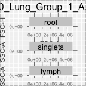

<!-- README.md is generated from README.Rmd. Please edit that file -->

# cytotypr

<!-- badges: start -->

<!-- badges: end -->

The goal of cytotypr is to …

## Installation

You can install the development version of cytotypr from
[GitHub](https://github.com/) with:

``` r
# install.packages("devtools")
devtools::install_github("aef1004/cytotypr")
```

## Example

This is a basic example which shows you how to solve a common problem:

``` r
library(cytotypr)
## basic example code
```

## Full Example

Note that I currently have only downloaded a few flow cytometry files.
They are from Cyto feature engineering T cell panel.

``` r
library(data.table)
library(openCyto)
library(ncdfFlow)
#> Loading required package: flowCore
#> Loading required package: RcppArmadillo
#> Loading required package: BH
library(flowWorkspace)
library(dplyr)
#> 
#> Attaching package: 'dplyr'
#> The following object is masked from 'package:ncdfFlow':
#> 
#>     filter
#> The following object is masked from 'package:flowCore':
#> 
#>     filter
#> The following objects are masked from 'package:data.table':
#> 
#>     between, first, last
#> The following objects are masked from 'package:stats':
#> 
#>     filter, lag
#> The following objects are masked from 'package:base':
#> 
#>     intersect, setdiff, setequal, union
library(ggcyto)
#> Loading required package: ggplot2
library(stringr) #this should be already added to the cytotypr package
library(scales)
```

Read in the initial gating strategy, which gates to live lymphocytes,
into a `gatingTemplate` class.

``` r
# Identify the file with the gating strategy 
ws <- list.files("./inst/extdata/", 
                 pattern = "gating_strategy.csv", 
                 full = TRUE)
ws
#> [1] "./inst/extdata//gating_strategy.csv"
```

``` r
# View this template
dtTemplate <- fread(ws)
dtTemplate
#>       alias pop   parent         dims gating_method              gating_args
#> 1: singlets   +     root  FSC-A,FSC-H   singletGate wider_gate=TRUE,maxit=20
#> 2:    lymph   + singlets        FSC-A    mindensity    gate_range=c(4e5,8e5)
#> 3:     live   -    lymph Zombie Nir-A    mindensity    gate_range=c(1e4,1e5)
#>    collapseDataForGating groupBy preprocessing_method preprocessing_args
#> 1:                    NA      NA                   NA                 NA
#> 2:                    NA      NA                   NA                 NA
#> 3:                    NA      NA                   NA                 NA
```

``` r
# Read in the gating strategy to a 'gatingTemplate' object
initial_gate <- gatingTemplate(ws) 
plot(initial_gate)
```


\#\#\# Read in the FMO data

``` r
# Identify the file names of all 20 FCS flow cytometry experiments to 
# read in. 
FMO_fcsFiles <- list.files("./inst/extdata/FMOs", full = TRUE)
FMO_fcsFiles
#>  [1] "./inst/extdata/FMOs/CD103" "./inst/extdata/FMOs/CD122"
#>  [3] "./inst/extdata/FMOs/CD153" "./inst/extdata/FMOs/CD27" 
#>  [5] "./inst/extdata/FMOs/CD28"  "./inst/extdata/FMOs/CD3"  
#>  [7] "./inst/extdata/FMOs/CD4"   "./inst/extdata/FMOs/CD44" 
#>  [9] "./inst/extdata/FMOs/CD62L" "./inst/extdata/FMOs/CD69" 
#> [11] "./inst/extdata/FMOs/CD8"   "./inst/extdata/FMOs/CTLA4"
#> [13] "./inst/extdata/FMOs/FoxP3" "./inst/extdata/FMOs/IFNG" 
#> [15] "./inst/extdata/FMOs/IL_10" "./inst/extdata/FMOs/IL_17"
#> [17] "./inst/extdata/FMOs/KLRG1" "./inst/extdata/FMOs/PD1"  
#> [19] "./inst/extdata/FMOs/Sca1"  "./inst/extdata/FMOs/TNF"
```

``` r
# Read these files into a 'ncdfFlowSet' object. This will taken a minute
# or so to run. The resulting 'ncdfFlowset' object contains row names with the 
# individual samples and column names with the markers/parameters used in the flow cytometer.
ncfs_FMO <- read.ncdfFlowSet(FMO_fcsFiles, channel_alias = data.frame(alias = c("Zombie Nir-A"), channels = c("Zombie_NIR-A, Zombie NIR-A, Zombie Nir-A"))) 
#> Not all FCS files have the same channels
#> Only load the following common channels:
#> Time
#> SSC-H
#> SSC-A
#> FSC-H
#> FSC-A
#> BV421-H
#> Pacific Blue-H
#> BV480-H
#> BV510-H
#> BV570-H
#> BV605-H
#> BV650-H
#> BV711-H
#> BV785-H
#> BB515-H
#> Alexa Fluor 532-H
#> PE-H
#> PE-Dazzle594-H
#> PE-Cy5-H
#> PE-Cy5.5-H
#> PerCP-eFluor 710-H
#> PE-Cy7-H
#> APC-H
#> APC-R700-H
#> APC-Fire 750-H
#> AF-H
#> BV421-A
#> Pacific Blue-A
#> BV480-A
#> BV510-A
#> BV570-A
#> BV605-A
#> BV650-A
#> BV711-A
#> BV785-A
#> BB515-A
#> Alexa Fluor 532-A
#> PE-A
#> PE-Dazzle594-A
#> PE-Cy5-A
#> PE-Cy5.5-A
#> PerCP-eFluor 710-A
#> PE-Cy7-A
#> APC-A
#> APC-R700-A
#> APC-Fire 750-A
#> Zombie Nir-A
#> AF-A
#> Skip the channels that are not found in all samples:
#> Zombie NIR-H
#> SSC-B-H
#> SSC-B-A
#> Zombie Nir-H
#> write CD103 to empty cdf slot...
#> write CD122 to empty cdf slot...
#> write CD153 to empty cdf slot...
#> write CD27 to empty cdf slot...
#> write CD28 to empty cdf slot...
#> write CD3 to empty cdf slot...
#> write CD4 to empty cdf slot...
#> write CD44 to empty cdf slot...
#> write CD62L to empty cdf slot...
#> write CD69 to empty cdf slot...
#> write CD8 to empty cdf slot...
#> write CTLA4 to empty cdf slot...
#> write FoxP3 to empty cdf slot...
#> write IFNG to empty cdf slot...
#> write IL_10 to empty cdf slot...
#> write IL_17 to empty cdf slot...
#> write KLRG1 to empty cdf slot...
#> write PD1 to empty cdf slot...
#> write Sca1 to empty cdf slot...
#> write TNF to empty cdf slot...
#> done!
ncfs_FMO
#> An ncdfFlowSet with 20 samples.
#> NCDF file : /var/folders/56/2lqw28ls6b1bnx36fgm2qfcc0000gn/T//RtmpBgiLWx/ncfs3516602923d5.nc 
#> An object of class 'AnnotatedDataFrame'
#>   rowNames: CD103 CD122 ... TNF (20 total)
#>   varLabels: name
#>   varMetadata: labelDescription
#> 
#>   column names:
#>     Time, SSC-H, SSC-A, FSC-H, FSC-A, BV421-H, Pacific Blue-H, BV480-H, BV510-H, BV570-H, BV605-H, BV650-H, BV711-H, BV785-H, BB515-H, Alexa Fluor 532-H, PE-H, PE-Dazzle594-H, PE-Cy5-H, PE-Cy5.5-H, PerCP-eFluor 710-H, PE-Cy7-H, APC-H, APC-R700-H, APC-Fire 750-H, AF-H, BV421-A, Pacific Blue-A, BV480-A, BV510-A, BV570-A, BV605-A, BV650-A, BV711-A, BV785-A, BB515-A, Alexa Fluor 532-A, PE-A, PE-Dazzle594-A, PE-Cy5-A, PE-Cy5.5-A, PerCP-eFluor 710-A, PE-Cy7-A, APC-A, APC-R700-A, APC-Fire 750-A, Zombie Nir-A, AF-A
```

Apply the initial gating to filter the data to only measurements on live
lymphocyte
cells.

``` r
# Convert to a 'GatingSet' object, so we can apply the initial gating to this data.
gs_FMO <- GatingSet(ncfs_FMO)
#> ....................done!
gs_FMO
#> A GatingSet with 20 samples
```

``` r
# Apply the initial gating to this data, to filter to only measurements
# on live lymphocyte cells. This may take a minute.
gt_gating(initial_gate, gs_FMO)
#> Gating for 'singlets'
#> done.
#> Gating for 'lymph'
#> done.
#> Gating for 'live'
#> done.
#> finished.

# You can plot the results of this gating with `plotGate`. For example, to plot
# the gating for the first sample, run:
plotGate(gs_FMO[[1]])
```


## Convert data to “tidy data” format

Now that the initial gating has been applied, to limit the data to
measurements oflive, singlet lymphocyte cells, we convert the data to a
“tidy data” format, to allow us to work with “tidyverse” tools for
further analysis and
visualization.

``` r
# Pull out the data from the 'live' node of the gating set (the last node
# in the initial gating strategy).
FMO_gated_data <- gs_pop_get_data(gs_FMO, "live") %>% 
  as.flowSet() 
```

Apply this function to the ‘flowSet’ of gated FMO data:

``` r
FMO_gated_data <- tidy_flow_set(FMO_gated_data)
FMO_gated_data
#> # A tibble: 417,910 x 49
#>    filename  Time `SSC-H` `SSC-A` `FSC-H` `FSC-A` `BV421-H` `Pacific Blue-H`
#>    <chr>    <dbl>   <dbl>   <dbl>   <dbl>   <dbl>     <dbl>            <dbl>
#>  1 CD103      130  105692  1.26e5  354442  6.45e5     -58.8             295.
#>  2 CD103      137  270246  3.16e5 1094791  1.59e6   -6837.              181.
#>  3 CD103      139  326197  3.77e5 1312044  1.80e6   -6375.             2438.
#>  4 CD103      149   74523  8.52e4  295947  5.57e5     285.              542.
#>  5 CD103      159  103797  1.10e5  293302  4.86e5    -419.              250.
#>  6 CD103      215  188622  2.20e5  355468  5.51e5    -589.             1265.
#>  7 CD103      233  275485  3.18e5 1264605  1.57e6   -3984.              770.
#>  8 CD103      242  262851  3.03e5  931615  1.20e6   -5463.             -680.
#>  9 CD103      501  205731  3.60e5  578193  6.76e5    -782.              865.
#> 10 CD103      590 1510416  2.11e6 1396843  1.87e6  -56700.              192.
#> # … with 417,900 more rows, and 41 more variables: `BV480-H` <dbl>,
#> #   `BV510-H` <dbl>, `BV570-H` <dbl>, `BV605-H` <dbl>, `BV650-H` <dbl>,
#> #   `BV711-H` <dbl>, `BV785-H` <dbl>, `BB515-H` <dbl>, `Alexa Fluor
#> #   532-H` <dbl>, `PE-H` <dbl>, `PE-Dazzle594-H` <dbl>, `PE-Cy5-H` <dbl>,
#> #   `PE-Cy5.5-H` <dbl>, `PerCP-eFluor 710-H` <dbl>, `PE-Cy7-H` <dbl>,
#> #   `APC-H` <dbl>, `APC-R700-H` <dbl>, `APC-Fire 750-H` <dbl>, `AF-H` <dbl>,
#> #   `BV421-A` <dbl>, `Pacific Blue-A` <dbl>, `BV480-A` <dbl>, `BV510-A` <dbl>,
#> #   `BV570-A` <dbl>, `BV605-A` <dbl>, `BV650-A` <dbl>, `BV711-A` <dbl>,
#> #   `BV785-A` <dbl>, `BB515-A` <dbl>, `Alexa Fluor 532-A` <dbl>, `PE-A` <dbl>,
#> #   `PE-Dazzle594-A` <dbl>, `PE-Cy5-A` <dbl>, `PE-Cy5.5-A` <dbl>, `PerCP-eFluor
#> #   710-A` <dbl>, `PE-Cy7-A` <dbl>, `APC-A` <dbl>, `APC-R700-A` <dbl>,
#> #   `APC-Fire 750-A` <dbl>, `Zombie Nir-A` <dbl>, `AF-A` <dbl>
```

``` r
# note that here the filename and the column marker names need to match exactly
FMO_gated_data_clean <- FMO_gated_data %>%
  select(ends_with("-A"), -`FSC-A`, `SSC-A`, filename) %>%
  dplyr::rename(`FoxP3` = "APC-A",
         `CD44` = "APC-Fire 750-A",
        `CD103` =  "APC-R700-A",       
         `CD3` = "Alexa Fluor 532-A",
         `Sca1` = "BB515-A",
         `IL_10` = "BV421-A",
         `CD4` = "BV480-A",
         `CD69` = "BV510-A",
         `CD8` = "BV570-A", 
         `CTLA4` = "BV605-A",
         `CD27` = "BV650-A",
         `CD153` = "BV711-A",
         `KLRG1` = "BV785-A",
         `IL_17` = "PE-A",
         `CD122` = "PE-Cy5-A",
         `IFN` = "PE-Cy7-A", 
         `CD62L` = "PE-Dazzle594-A",
         `TNF` = "Pacific Blue-A", 
         `CD28` = "PE-Cy5.5-A",
         `PD1` = "PerCP-eFluor 710-A")  %>%
   na.omit()%>%
  dplyr::filter(`SSC-A` != max(`SSC-A`)) %>%
  mutate(filename = str_replace(filename, "IFNG", "IFN"))

  
right <- filter_FMO(FMO_gated_data_clean)

add_quantile <- get_99(right)

plot_FMOs(right, add_quantile)
#> Warning: Removed 25721 rows containing missing values (geom_vline).
```


### Gating the sample data

I checked that all D30, D60, and D90 samples have Zombie and will run
all the way through the gating when separated by day. Looking at the
data, some of them are labeled Zombie NIR-A and Zombie Nir-A which means
that they are not recognized as the same. - D90 has uncapitalized. I
will need to read them in separately and then rename one of the two so
that the cases match

``` r

fcsFiles <- list.files("./inst/extdata/Tcell_samples", 
                       pattern = ".fcs", full = TRUE)

# ncdfFlowset object contains row names with the individual samples and column names with the markers/parameters used in the flow cytometer
ncfs <- read.ncdfFlowSet(fcsFiles, channel_alias = data.frame(alias = c("Zombie Nir-A"), channels = c("Zombie_NIR-A, Zombie NIR-A, Zombie Nir-A"))) 
#> Not all FCS files have the same channels
#> Only load the following common channels:
#> Time
#> SSC-H
#> SSC-A
#> FSC-H
#> FSC-A
#> BV421-A
#> Pacific Blue-A
#> BV480-A
#> BV510-A
#> BV570-A
#> BV605-A
#> BV650-A
#> BV711-A
#> BV785-A
#> BB515-A
#> Alexa Fluor 532-A
#> PE-A
#> PE-Dazzle594-A
#> PE-Cy5-A
#> PE-Cy5.5-A
#> PerCP-eFluor 710-A
#> PE-Cy7-A
#> APC-A
#> APC-R700-A
#> APC-Fire 750-A
#> Zombie Nir-A
#> AF-A
#> Skip the channels that are not found in all samples:
#> BV421-H
#> Pacific Blue-H
#> BV480-H
#> BV510-H
#> BV570-H
#> BV605-H
#> BV650-H
#> BV711-H
#> BV785-H
#> BB515-H
#> Alexa Fluor 532-H
#> PE-H
#> PE-Dazzle594-H
#> PE-Cy5-H
#> PE-Cy5.5-H
#> PerCP-eFluor 710-H
#> PE-Cy7-H
#> APC-H
#> APC-R700-H
#> APC-Fire 750-H
#> Zombie NIR-H
#> AF-H
#> SSC-B-H
#> SSC-B-A
#> Zombie Nir-H
#> SSC-W
#> FSC-W
#> write D30_Lung_Group 1 A_20190218_153157_Unmixed.fcs to empty cdf slot...
#> write D30_Lung_Group 1 B_20190218_153216_Unmixed.fcs to empty cdf slot...
#> write D30_Lung_Group 1 C_20190218_153233_Unmixed.fcs to empty cdf slot...
#> write D30_Lung_Group 1 D_20190218_153300_Unmixed.fcs to empty cdf slot...
#> write D30_Lung_Group 2 A_20190218_153318_Unmixed.fcs to empty cdf slot...
#> write D30_Lung_Group 2 B_20190218_153336_Unmixed.fcs to empty cdf slot...
#> write D30_Lung_Group 2 C_20190218_153354_Unmixed.fcs to empty cdf slot...
#> write D30_Lung_Group 2 D_20190218_153411_Unmixed.fcs to empty cdf slot...
#> write D60 Lung_Group 1 A_20190314_163954_Unmixed.fcs to empty cdf slot...
#> write D60 Lung_Group 1 B_20190314_164008_Unmixed.fcs to empty cdf slot...
#> write D60 Lung_Group 1 C_20190314_165522_Unmixed.fcs to empty cdf slot...
#> write D60 Lung_Group 1 D_20190314_165533_Unmixed.fcs to empty cdf slot...
#> write D60 Lung_Group 1 E_20190314_165559_Unmixed.fcs to empty cdf slot...
#> write D60 Lung_Group 2 A_20190314_165606_Unmixed.fcs to empty cdf slot...
#> write D60 Lung_Group 2 B_20190314_165614_Unmixed.fcs to empty cdf slot...
#> write D60 Lung_Group 2 C_20190314_165622_Unmixed.fcs to empty cdf slot...
#> write D60 Lung_Group 2 D_20190314_165629_Unmixed.fcs to empty cdf slot...
#> write D90_Lung_Group 1 A_Unmixed.fcs to empty cdf slot...
#> write D90_Lung_Group 1 B_Unmixed.fcs to empty cdf slot...
#> write D90_Lung_Group 1 C_Unmixed.fcs to empty cdf slot...
#> write D90_Lung_Group 1 D_Unmixed.fcs to empty cdf slot...
#> write D90_Lung_Group 2 A_Unmixed.fcs to empty cdf slot...
#> write D90_Lung_Group 2 B_Unmixed.fcs to empty cdf slot...
#> write D90_Lung_Group 2 C_Unmixed.fcs to empty cdf slot...
#> write D90_Lung_Group 2 D_Unmixed.fcs to empty cdf slot...
#> done!

# apply gating set
gs <- GatingSet(ncfs)
#> .
#> ........................done!

# gate the samples
gt_gating(initial_gate, gs)
#> Gating for 'singlets'
#> done.
#> Gating for 'lymph'
#> done.
#> Gating for 'live'
#> done.
#> finished.

# View the gates
plotGate(gs[[1]])
```



``` r

ggcyto(gs[[3]], aes(x = `Zombie Nir-A`)) + 
  geom_area(stat = "density", fill = "#440154FF") +
  geom_gate("live")   +
  ggcyto_par_set(limits = list(y = c(0, 5e-5), x = c(-1000, 1e5)))+
  xlab("Zombie NIR-A") +
  ylab("Density") +
  ggtitle("Live") +
  theme_gray() +
  geom_stats(size = 5, adjust = 0.45, position = position_nudge(x = 5000)) +
  labs_cyto("both") + 
  theme(strip.text = element_blank(),
        axis.text = element_text(size = 18),
        axis.title = element_text(size = 20),
        title = element_text(size = 20))+
  scale_x_continuous(n.breaks = 3)
#> Coordinate system already present. Adding new coordinate system, which will replace the existing one.
```


Pull out the gated data

``` r
# Pull out the gated data - could potentially add to the function below
gated_data <- gs_pop_get_data(gs, "live") %>% 
  as.flowSet() 

# tidy the flowset and convert to a dataframe
all_gated_df <-  tidy_flow_set(gated_data) 

unique(all_gated_df$filename)
#>  [1] "D30_Lung_Group 1 A_20190218_153157_Unmixed.fcs"
#>  [2] "D30_Lung_Group 1 B_20190218_153216_Unmixed.fcs"
#>  [3] "D30_Lung_Group 1 C_20190218_153233_Unmixed.fcs"
#>  [4] "D30_Lung_Group 1 D_20190218_153300_Unmixed.fcs"
#>  [5] "D30_Lung_Group 2 A_20190218_153318_Unmixed.fcs"
#>  [6] "D30_Lung_Group 2 B_20190218_153336_Unmixed.fcs"
#>  [7] "D30_Lung_Group 2 C_20190218_153354_Unmixed.fcs"
#>  [8] "D30_Lung_Group 2 D_20190218_153411_Unmixed.fcs"
#>  [9] "D60 Lung_Group 1 A_20190314_163954_Unmixed.fcs"
#> [10] "D60 Lung_Group 1 B_20190314_164008_Unmixed.fcs"
#> [11] "D60 Lung_Group 1 C_20190314_165522_Unmixed.fcs"
#> [12] "D60 Lung_Group 1 D_20190314_165533_Unmixed.fcs"
#> [13] "D60 Lung_Group 1 E_20190314_165559_Unmixed.fcs"
#> [14] "D60 Lung_Group 2 A_20190314_165606_Unmixed.fcs"
#> [15] "D60 Lung_Group 2 B_20190314_165614_Unmixed.fcs"
#> [16] "D60 Lung_Group 2 C_20190314_165622_Unmixed.fcs"
#> [17] "D60 Lung_Group 2 D_20190314_165629_Unmixed.fcs"
#> [18] "D90_Lung_Group 1 A_Unmixed.fcs"                
#> [19] "D90_Lung_Group 1 B_Unmixed.fcs"                
#> [20] "D90_Lung_Group 1 C_Unmixed.fcs"                
#> [21] "D90_Lung_Group 1 D_Unmixed.fcs"                
#> [22] "D90_Lung_Group 2 A_Unmixed.fcs"                
#> [23] "D90_Lung_Group 2 B_Unmixed.fcs"                
#> [24] "D90_Lung_Group 2 C_Unmixed.fcs"                
#> [25] "D90_Lung_Group 2 D_Unmixed.fcs"
```
